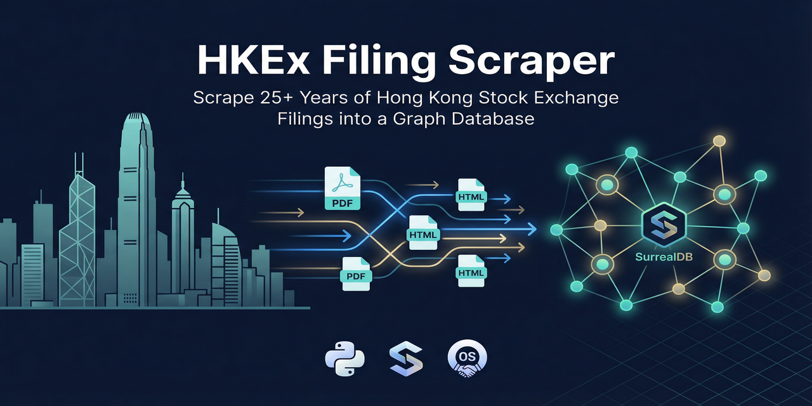

# HKEx Filing Scraper



[](https://github.com/simonplmak-cloud/hkex-filing-scraper/releases)
[](https://opensource.org/licenses/MIT)
[](https://www.python.org/downloads/)
[](https://surrealdb.com)

Open-source tool to scrape and ingest HKEx (Hong Kong Stock Exchange) regulatory filings into a SurrealDB database. It includes full-text extraction from PDF/HTML/Excel documents and optional graph linking between companies and filings.

This tool uses the undocumented HKEx JSON API, which is significantly faster and more reliable than browser-based scraping.

## Features

- **Fast API Scraping**: Directly uses the HKEx JSON API, no browser required.
- **Full Historical Data**: Can scrape the entire history of filings from April 1999 to the present day.
- **Document Processing**: Downloads filing documents (PDF, HTML, Excel) and extracts full text and structured tables.
- **Graph Linking**: Optionally creates graph edges in SurrealDB between your existing company table and the filings they release (`has_filing`), as well as edges for companies mentioned in filing titles (`references_filing`).
- **Resilient & Parallel**: Uses batching, parallel downloads, and recursive retries to handle large volumes of data and network interruptions.
- **Configurable & Modular**: Easily configured via environment variables and structured as a modern Python package.

## Installation

Clone the repository and install with `pip`:

```bash
git clone https://github.com/simonplmak-cloud/hkex-filing-scraper.git
cd hkex-filing-scraper
pip install ".[all]"
```

The `[all]` extras include PDF extraction (PyMuPDF, Camelot), Excel parsing (openpyxl), and environment variable loading (python-dotenv). For a minimal install without document processing:

```bash
pip install .
```

## Configuration

The scraper is configured using environment variables. Create a `.env` file in your project directory by copying the example:

```bash
cp .env.example .env
```

Then, edit `.env` with your SurrealDB connection details.

```ini
# .env

# --- SurrealDB Connection (REQUIRED) ---
SURREAL_ENDPOINT=http://localhost:8000
SURREAL_NAMESPACE=default
SURREAL_DATABASE=default
SURREAL_USERNAME=root
SURREAL_PASSWORD=your_surrealdb_password

# --- Graph Linking (OPTIONAL) ---
# Set COMPANY_TABLE to enable graph edges between companies and filings.
# Leave empty to disable.
COMPANY_TABLE=company

# Pattern for converting a ticker like "0451.HK" into a record ID.
# Default: "{code}_{exchange}" produces "451_HK".
COMPANY_ID_PATTERN={code}_{exchange}
```

## Usage

The scraper is run from the command line.

```bash
# Scrape the last ~2 months of filings and download their documents
hkex-scraper

# Scrape the full history from 1999 to today
hkex-scraper --full-history

# Scrape a specific date range
hkex-scraper --from-date 01/01/2024 --to-date 31/01/2024

# Scrape metadata only (no document downloads)
hkex-scraper --metadata-only

# Backfill documents for existing filings that haven't been processed yet
hkex-scraper --backfill-docs

# Limit to the 500 most recent filings
hkex-scraper --limit 500

# Only create/refresh graph edges (no scraping or downloading)
hkex-scraper --link-only
```

### Command-Line Options

| Flag              | Description                                                              |
| ----------------- | ------------------------------------------------------------------------ |
| `--full-history`  | Scrape all filings from April 1999 to today.                             |
| `--from-date`     | Start date for scraping (DD/MM/YYYY).                                    |
| `--to-date`       | End date for scraping (DD/MM/YYYY).                                      |
| `--limit N`       | Limit processing to the `N` most recent filings.                         |
| `--metadata-only` | Phase 1 only: scrape metadata without downloading documents.             |
| `--backfill-docs` | Phase 2 only: download documents for existing filings.                   |
| `--link-only`     | Only create/refresh graph edges (no scraping or downloading).            |
| `--dry-run`       | Test mode: fetch data but do not write to the database.                  |

## Database Schema

The scraper creates and manages the `exchange_filing` table in your SurrealDB database. If graph linking is enabled, it also creates the `has_filing` and `references_filing` edge tables.

### `exchange_filing` Table

This table is `SCHEMAFULL` and contains the following fields:

| Field                | Type            | Description                                                                 |
| -------------------- | --------------- | --------------------------------------------------------------------------- |
| `id`                 | `record`        | SurrealDB record ID (e.g., `exchange_filing:a1b2c3d4e5f6a7b8`).             |
| `filingId`           | `string`        | Internal MD5 hash of key fields for deduplication.                          |
| `companyTicker`      | `string`        | Standardized ticker (e.g., `0700.HK`).                                      |
| `stockCode`          | `string`        | Original stock code from HKEx (e.g., `00700`).                              |
| `stockName`          | `string`        | Company name from HKEx.                                                     |
| `exchange`           | `string`        | Always `HK`.                                                                |
| `filingType`         | `string`        | Classified type (e.g., `ANNUAL_REPORT`, `RESULTS`, `OTHER`).                |
| `filingSubtype`      | `string`        | Classified subtype (e.g., `Annual Report`, `Interim Results`).              |
| `title`              | `string`        | The full title of the filing.                                               |
| `filingDate`         | `datetime`      | The date the filing was released.                                           |
| `documentUrl`        | `string`        | The direct URL to the filing document.                                      |
| `referencedTickers`  | `array<string>` | List of other stock tickers mentioned in the title.                         |
| `source`             | `string`        | Data source, always `HKEx`.                                                 |
| `updatedAt`          | `datetime`      | Timestamp of the last update to this record.                                |
| `documentSize`       | `int`           | Size of the downloaded document in bytes.                                   |
| `documentType`       | `string`        | Type of document (`pdf`, `html`, `xlsx`).                                   |
| `documentHash`       | `string`        | MD5 hash of the document content.                                           |
| `documentText`       | `string`        | Full extracted text content.                                                |
| `documentTextLen`    | `int`           | Length of the extracted text.                                               |
| `documentTables`     | `array<object>` | Array of structured tables extracted from the document (as Markdown).       |
| `documentTableCnt`   | `int`           | Count of extracted tables.                                                  |
| `documentStatus`     | `string`        | Processing status (`processed`, `skipped`, `failed`).                       |
| `documentStatusReason` | `string`      | Reason for a `skipped` or `failed` status (e.g., `too_large`, `http_404`).    |

## Development

To set up a development environment:

1.  Clone the repository.
2.  Create and activate a virtual environment.
3.  Install the package in editable mode with development dependencies:

    ```bash
    pip install -e ".[dev,all]"
    ```

4.  Run tests using `pytest`:

    ```bash
    pytest
    ```

## License

This project is licensed under the MIT License. See the [LICENSE](LICENSE) file for details.
