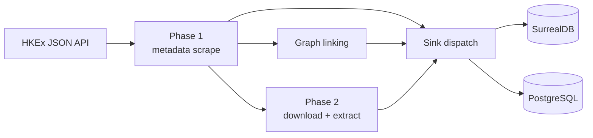
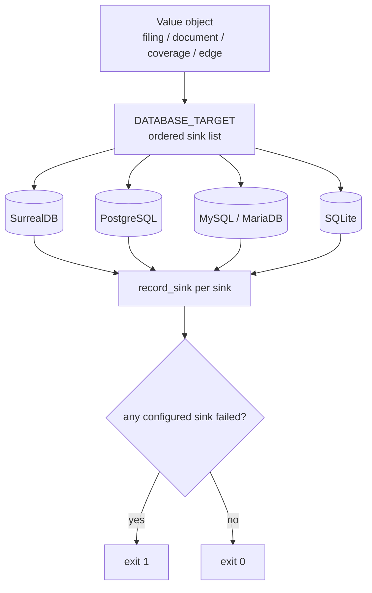

# Architecture

## Two-phase pipeline

**Phase 1 — metadata.** `api.py` establishes a JSF session (`ViewState`), splits the range into monthly chunks, paginates `titleSearchServlet.do`, and parses records. Each filing is classified and deduplicated by a 16-char MD5 key (`filingId`), then persisted.

**Graph linking.** With `COMPANY_TABLE` set, `graph.py` creates `has_filing` and `references_filing` edges.

**Phase 2 — documents.** Filings with a URL but no `documentStatus` are downloaded in parallel, extracted to Markdown text + structured tables (`extractor.py`), and saved.

## Sink seam

Persistence is centralised behind one contract so a new destination is a localised change:

- `sinks/base.py` defines `Sink` (write/read methods returning `(value, error_code)`) and
  `SinkCapabilities` (upsert, reads, edges, JSON, arrays, limits).
- `sinks/registry.py` maps each id (`postgres`, `mysql`, `mariadb`, `sqlite`, `surrealdb`) to
  its licence, optional extra, and a **lazily imported** factory.
- `sinks/relational.py` + `sinks/dialects.py` implement every SQL dialect through one shared
  loop; `sinks/postgres.py` adapts the existing `db_postgres.py`; `sinks/surrealdb.py` owns
  SurrealQL, `RELATE`, the RPC→`/sql` fallback, and company-id resolution.
- `config.py` parses `DATABASE_TARGET` into an ordered list (`sink_ids()`); reads are served
  by the first configured sink whose capabilities include `reads`.
- `pipeline.py` builds one canonical value object per filing/document/coverage/edge and
  dispatches it to every configured sink, counting per-sink successes/failures
  (`record_sink`, `sink_exit_code`).
- `main.py` fails fast when any configured sink is unusable and exits non-zero when any
  configured sink recorded failures.

## Failure isolation

- SurrealDB first, PostgreSQL second; each write is attempted independently.
- A failure on one sink is logged, counted, and never blocks or rolls back the other.
- Optional-sink failures do not fail the run; required-sink failures produce a non-zero exit.
- Missing driver/DSN degrades gracefully unless PostgreSQL is the only configured sink.

## Data fidelity

- Text and tables are extracted once and the same truncation decision is applied to both sinks.
- Truncation and skip reasons are surfaced via `documentStatus` / `documentStatusReason` (SurrealDB) and `document_status` / `document_status_reason` (PostgreSQL).
- `document_tables` preserves the object shape in PostgreSQL `jsonb`; `referenced_tickers` becomes `text[]`.

## Module map

| Module | Responsibility |
| ------ | -------------- |
| `main.py` | CLI parsing, validation, orchestration, reporting |
| `config.py` | Environment variables + constants; sink resolution |
| `api.py` | HKEx JSON API session, chunking, record parsing |
| `pipeline.py` | Phase 1/2 loops, sink dispatch, per-sink accounting |
| `extractor.py` | PDF/HTML/Excel → Markdown + tables |
| `db.py` | SurrealDB `/sql` + `/rpc`, schema DDL, batch upsert |
| `db_postgres.py` | PostgreSQL DDL, upserts, read helpers |
| `graph.py` | Edge creation (both sinks) |
| `utils.py` | Logging, classification, ticker extraction |
