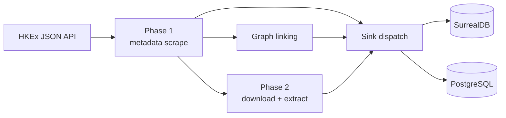
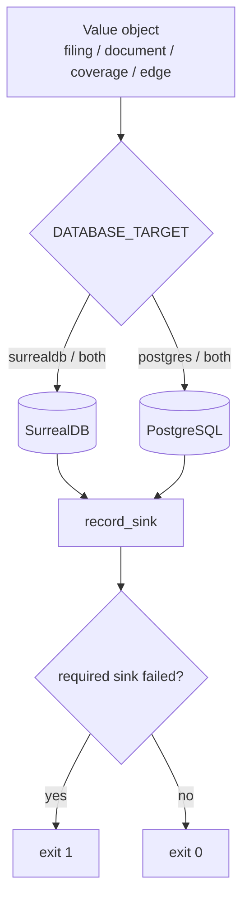

# Architecture

## Two-phase pipeline

**Phase 1 — metadata.** `api.py` establishes a JSF session (`ViewState`), splits the range into monthly chunks, paginates `titleSearchServlet.do`, and parses records. Each filing is classified and deduplicated by a 16-char MD5 key (`filingId`), then persisted.

**Graph linking.** With `COMPANY_TABLE` set, `graph.py` creates `has_filing` and `references_filing` edges.

**Phase 2 — documents.** Filings with a URL but no `documentStatus` are downloaded in parallel, extracted to Markdown text + structured tables (`extractor.py`), and saved.

## Sink seam

Persistence is centralised so a second destination can be added without touching scrape/extract logic:

- `config.py` resolves `DATABASE_TARGET` into `surrealdb_enabled()` / `postgres_enabled()` / `postgres_required()`.
- `db.py` writes to SurrealDB (`/rpc` first, `/sql` fallback).
- `db_postgres.py` writes to PostgreSQL (optional `psycopg` import, idempotent DDL, parameterised `ON CONFLICT` upserts).
- `pipeline.py` dispatches each value object to every configured sink and counts per-sink successes/failures (`record_sink`, `sink_exit_code`).
- `main.py` fails fast when a required sink is unusable and exits non-zero when a required sink recorded failures.

## Failure isolation

- SurrealDB first, PostgreSQL second; each write is attempted independently.
- A failure on one sink is logged, counted, and never blocks or rolls back the other.
- Optional-sink failures do not fail the run; required-sink failures produce a non-zero exit.
- Missing driver/DSN degrades gracefully unless PostgreSQL is the only configured sink.

## Data fidelity

- Text and tables are extracted once and the same truncation decision is applied to both sinks.
- Truncation and skip reasons are surfaced via `documentStatus` / `documentStatusReason` (SurrealDB) and `document_status` / `document_status_reason` (PostgreSQL).
- `document_tables` preserves the object shape in PostgreSQL `jsonb`; `referenced_tickers` becomes `text[]`.

## Module map

| Module | Responsibility |
| ------ | -------------- |
| `main.py` | CLI parsing, validation, orchestration, reporting |
| `config.py` | Environment variables + constants; sink resolution |
| `api.py` | HKEx JSON API session, chunking, record parsing |
| `pipeline.py` | Phase 1/2 loops, sink dispatch, per-sink accounting |
| `extractor.py` | PDF/HTML/Excel → Markdown + tables |
| `db.py` | SurrealDB `/sql` + `/rpc`, schema DDL, batch upsert |
| `db_postgres.py` | PostgreSQL DDL, upserts, read helpers |
| `graph.py` | Edge creation (both sinks) |
| `utils.py` | Logging, classification, ticker extraction |
