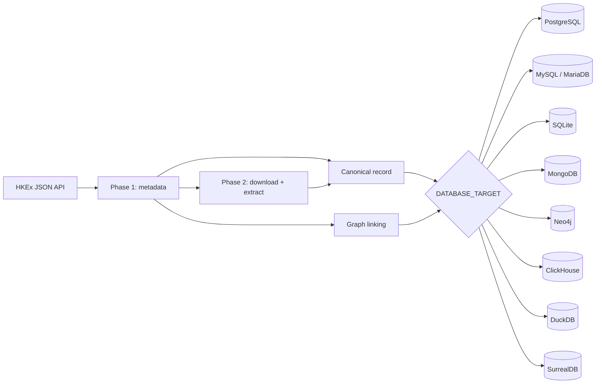
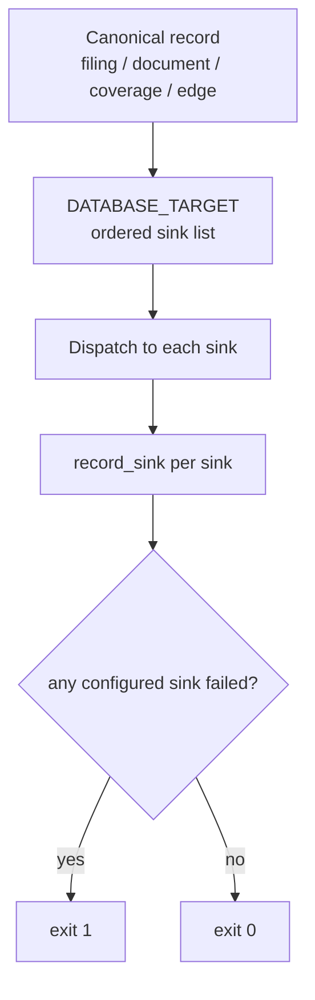

# Architecture

## Two-phase pipeline

**Phase 1 — metadata.** `api.py` establishes a JSF session (`ViewState`), splits the range
into monthly chunks, paginates `titleSearchServlet.do`, and parses records. Each filing is
classified and deduplicated by a 16-char MD5 key (`filingId`), then persisted.

**Graph linking.** With `COMPANY_TABLE` set, `graph.py` creates `has_filing` and
`references_filing` edges on every edge-capable sink.

**Phase 2 — documents.** Filings with a URL but no `documentStatus` are downloaded in
parallel, extracted to Markdown text + structured tables (`extractor.py`), and saved.

## Sink seam

Persistence is centralised behind one contract so a new destination is a localised change:

- `sinks/base.py` defines `Sink` (write/read methods returning `(value, error_code)`) and
  `SinkCapabilities` (upsert, reads, edges, JSON, arrays, limits).
- `sinks/registry.py` maps each id — `postgres`, `mysql`, `sqlite`, `mongodb`, `mariadb`,
  `neo4j`, `clickhouse`, `duckdb`, `surrealdb` — to its license, OSI status, optional extra,
  and a **lazily imported** factory.
- `sinks/relational.py` + `sinks/dialects.py` implement the SQL dialects (PostgreSQL,
  MySQL/MariaDB, SQLite, DuckDB) through one shared loop; the remaining adapters are
  `sinks/postgres.py`, `sinks/mongodb.py`, `sinks/clickhouse.py`, `sinks/neo4j.py`, and
  `sinks/surrealdb.py`.
- `config.py` parses `DATABASE_TARGET` into an ordered list (`sink_ids()`); reads are served
  by the first configured sink whose capabilities include `reads`.
- `pipeline.py` builds one canonical value object per filing/document/coverage/edge and
  dispatches it to every configured sink, counting per-sink successes/failures
  (`record_sink`, `sink_exit_code`).
- `main.py` fails fast when any configured sink is unusable and exits non-zero when any
  configured sink recorded failures.

## Failure isolation

- Every configured sink is attempted independently, in `DATABASE_TARGET` order.
- A failure on one sink is logged, counted, and never blocks or rolls back another.
- Every configured sink is required: any write failure marks the run non-zero.
- A configured but unusable sink (missing driver or connection settings) fails fast with an
  actionable message rather than silently writing nothing.

## Data fidelity

- Text and tables are extracted once into one canonical payload; each sink applies its own
  declared limit (for example, the SurrealDB adapter truncates to fit its RPC body size,
  while the relational sinks store the text column unchanged).
- Truncation and skip reasons are surfaced via `documentStatus`/`documentStatusReason`
  (SurrealDB, Neo4j) and `document_status`/`document_status_reason` (relational).
- `document_tables` keeps its object shape per sink: `jsonb` (PostgreSQL), `json`
  (MySQL/MariaDB), JSON text (SQLite/DuckDB/ClickHouse), an embedded array (MongoDB), or a
  JSON string (Neo4j). `referenced_tickers` is `text[]` (PostgreSQL), `json` (MySQL),
  JSON text (SQLite/DuckDB), `Array(String)` (ClickHouse), an array (MongoDB), or a string
  array (Neo4j).

## Edge semantics

- Every edge-capable sink creates `has_filing` and `references_filing` edges, deriving the
  company key from `COMPANY_ID_PATTERN`.
- The SurrealDB adapter additionally requires the ticker to exist in the configured company
  table; MongoDB and Neo4j also create the company node/document.

## Module map

| Module | Responsibility |
| ------ | -------------- |
| `main.py` | CLI parsing, validation, orchestration, per-sink schema init, N-way parity |
| `config.py` | Environment variables + constants; `sink_ids()` parses `DATABASE_TARGET` |
| `api.py` | HKEx JSON API session, chunking, record parsing |
| `pipeline.py` | Phase 1/2 loops, canonical records, sink dispatch, per-sink accounting |
| `extractor.py` | PDF/HTML/Excel → Markdown + tables |
| `db.py` | SurrealDB `/sql` + `/rpc`, schema DDL, batch upsert |
| `db_postgres.py` | PostgreSQL DDL, upserts, read helpers |
| `sinks/base.py` | `Sink` contract, `SinkCapabilities`, error codes, `redact()` |
| `sinks/registry.py` | Lazy id→factory map with license/OSI/extra metadata |
| `sinks/dialects.py` | Per-dialect SQL: placeholders, quoting, types, upsert/DDL/select builders |
| `sinks/relational.py` | Shared relational engine (batching, redaction, degradation) |
| `sinks/{postgres,mysql,sqlite,duckdb}.py` | Relational adapters |
| `sinks/{mongodb,clickhouse,neo4j}.py` | Document, columnar, and graph adapters |
| `sinks/surrealdb.py` | SurrealQL, `RELATE`, RPC→`/sql` fallback, company-id resolution |
| `graph.py` | Edge dispatch to every edge-capable sink |
| `utils.py` | Logging, classification, ticker extraction, company-key helpers |
