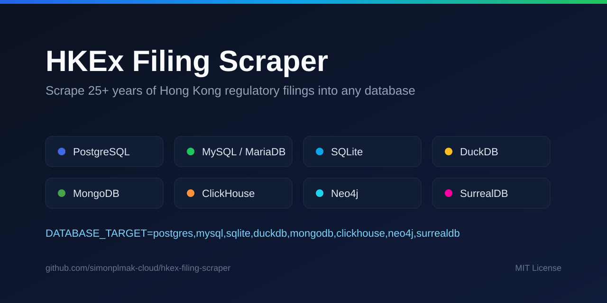

# HKEx Filing Scraper — Docs

An open-source Python tool that scrapes 25+ years of Hong Kong Stock Exchange (HKEx)
regulatory filings and ingests them into **any of nine databases** — with full-text and table
extraction, chunk-level coverage, optional graph linking, and a **hosted MCP gateway** so AI
agents can query HKEx live.

[Try the hosted endpoint](live-mcp.md){ .md-button .md-button--primary }
[Getting started](getting-started.md){ .md-button }
[AI agent support](ai-agents.md){ .md-button }
[GitHub](https://github.com/simonplmak-cloud/hkex-filing-scraper){ .md-button }

## Start here

- [Getting started](getting-started.md)
- [Database sinks (support matrix)](sinks/README.md)
- [Configuration reference](configuration.md)
- [CLI reference](cli.md)
- [MCP server](mcp.md)
- [Live MCP gateway](live-mcp.md) — the hosted, no-install endpoint
- [AI agent support](ai-agents.md)
- [Try it locally (`examples/`)](https://github.com/simonplmak-cloud/hkex-filing-scraper/tree/main/examples)

## Per-sink guides

Every sink is a first-class destination. Rows are in the documented popularity order.

- `postgres` — [PostgreSQL](sinks/postgresql.md)
- `mysql` — [MySQL and MariaDB](sinks/mysql.md)
- `sqlite` — [SQLite](sinks/sqlite.md)
- `mongodb` — [MongoDB](sinks/mongodb.md)
- `mariadb` — [MySQL and MariaDB](sinks/mysql.md)
- `neo4j` — [Neo4j](sinks/neo4j.md)
- `clickhouse` — [ClickHouse](sinks/clickhouse.md)
- `duckdb` — [DuckDB](sinks/duckdb.md)
- `surrealdb` — [SurrealDB](sinks/surrealdb.md)

## Operations

- [Architecture](architecture.md)
- [Troubleshooting](troubleshooting.md)
- [Testing](testing.md)
- [De-risking register](de-risking.md)
- [Legal & Terms of Use](legal.md)

## Releasing

- [How to make a release](releasing.md)
- [Release automation reference](release-automation.md)
- [Upgrading](upgrading.md)

## Decisions

- [ADR 0001 — Versioning and release automation](adr/0001-versioning-and-release-automation.md)
- [ADR 0002 — Multi-sink architecture](adr/0002-multi-sink-architecture.md)
- [ADR 0003 — Sink support policy](adr/0003-sink-support-policy.md)
- [ADR 0004 — Publish to PyPI](adr/0004-publish-to-pypi-trusted-publishing.md)

## Project

- [Documentation style guide](STYLE.md)
- [README](https://github.com/simonplmak-cloud/hkex-filing-scraper#readme)
- [Contributing](https://github.com/simonplmak-cloud/hkex-filing-scraper/blob/main/CONTRIBUTING.md)
- [Changelog](https://github.com/simonplmak-cloud/hkex-filing-scraper/blob/main/CHANGELOG.md)
