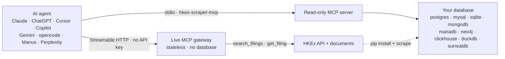

# Live MCP gateway

The **live MCP gateway** exposes HKEx filings to MCP clients over HTTP, fetching fresh data
from the HKEx website on every call. It is the hosted companion to the [MCP server](mcp.md):
where that server runs over stdio and reads a *stored* corpus from a database sink, this
gateway is **stateless**, stores nothing, and needs no database.

Endpoint:

```text
https://hkex-listco-updates.ascent-partners.com/api/mcp
```

The endpoint speaks **Streamable HTTP**: send `POST` requests carrying JSON-RPC 2.0. It is
not a web page — opening the URL in a browser sends `GET`, which the gateway answers with
`405 Method Not Allowed` (the MCP specification allows this when no server-sent-events
stream is offered). Cross-origin clients are supported through an `OPTIONS` CORS preflight
and an `Origin` allowlist.

## How it works

The gateway is the hosted, database-free half of the project. The [MCP server](mcp.md) is the
local half; the same client can use either.



If the diagram does not render, it is also available as
[an image](assets/mcp.png) — the tools and limits below are the full interface.

## Tools

| Tool | What it does |
| ---- | ------------ |
| `get_server_info` | Reports the gateway version, transport, and hard limits. Reads nothing. |
| `search_filings` | Searches live filings in a date window (at most 31 days), optionally filtered to one stock code. |
| `get_filing` | Downloads one HKEx document and extracts its text and tables. |

Every tool is **read-only**. The gateway never writes, never runs schema DDL, and never
fetches an arbitrary URL — `get_filing` accepts only HKEx document hosts.

## Limits

The model cannot raise these:

| Limit | Value |
| ----- | ----- |
| Search window | 31 days per call |
| `max_results` | 200 |
| Extracted text | 300,000 characters per document |
| Tables | 30 per document |

## Connecting a client

The gateway speaks **Streamable HTTP** (stateless, JSON responses) at `/api/mcp` and needs no
authentication. The full client list — Claude, ChatGPT, Cursor, Copilot, Gemini, opencode,
Manus, and Perplexity — is in [AI agent support](ai-agents.md).

**opencode** (`opencode.json`):

```json
{
  "$schema": "https://opencode.ai/config.json",
  "mcp": {
    "hkex-live": {
      "type": "remote",
      "url": "https://hkex-listco-updates.ascent-partners.com/api/mcp",
      "enabled": true
    }
  }
}
```

**Claude** — add it as a custom connector pointing at the endpoint URL, choosing
"no authentication".

**Cursor** (`~/.cursor/mcp.json`):

```json
{
  "mcpServers": {
      "hkex-live": {
        "url": "https://hkex-listco-updates.ascent-partners.com/api/mcp"
      }
  }
}
```

## Security

The gateway is a deliberately public, read-only API over public filings data. Its controls
are:

- **Read-only by construction** — three read tools; no write, SQL, or arbitrary-fetch surface.
- **SSRF allowlist** — documents are fetched only from HKEx hosts (`www1.hkexnews.hk`).
- **Origin validation** — requests carrying a disallowed `Origin` are rejected (MCP's
  DNS-rebinding mitigation).
- **No caching** — responses are sent with `Cache-Control: no-store`.
- **Rate limiting** — a Vercel Firewall rule limits `/api/mcp` to 120 requests per 60 seconds
  per IP; excess requests are answered with `429 Too Many Requests`.
- **Liveness** — `GET /api/healthz` returns `{"ok":true}` and reads nothing.
- **Bounded responses** — the limits above keep every response well within the platform body
  limit.

## Deployment

The gateway is a single Python function on Vercel, deployed from this repository alongside
the documentation site. The transport is implemented directly in
`src/hkex_scraper/live_mcp.py` (it needs no server SDK and no ASGI lifespan), and the Vercel
entry point is `api/mcp.py`.

The project is linked to GitHub, so deployment is automatic: pushes to `main` deploy to
production (`https://hkex-listco-updates.ascent-partners.com/`), and every other branch or
pull request deploys an isolated preview. The function runs in the Hong Kong region (`hkg1`)
with a Singapore failover (`sin1`), and it is configured with Fluid compute so document
extraction can run within the function's execution budget.

The document-extraction libraries (`PyMuPDF`, `pymupdf4llm`, `openpyxl`) are AGPL-3.0, so
they are not published dependencies of the distribution (see [Legal](legal.md)); the
deployment installs them through the `deploy` dependency group in `pyproject.toml`.
`pymupdf4llm` is pinned to a release that depends only on PyMuPDF — its 1.x line pulls an
additional layout model (onnxruntime and numpy) that exceeds the serverless bundle limit.

## See also

- [AI agent support](ai-agents.md) — configuration for Claude, ChatGPT, Cursor, Copilot, Gemini, opencode, Manus, and Perplexity.
- [MCP server](mcp.md) — the stdio server over a stored corpus.
- [Configuration](configuration.md) — environment variables for the CLI and sinks.
