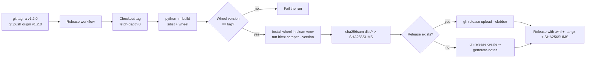

# Release Automation — Reference

This document explains how releases are built and published, **why** it is done this way,
what can go wrong, and how to fix it. It is written to still be useful years from now,
when nobody remembers the original setup.

For the short "just do it" version, see [releasing.md](releasing.md).

---

## 1. Mental model

- A **tag** like `v1.2.0` is the source of truth for the version. There is no version
  number to edit in the code.
- Pushing a tag runs the **Release** workflow.
- The workflow **builds** the package, **checks** it, and **attaches** the files to a
  GitHub **Release**.
- Consumers install from the tag or from the attached wheel.

If you remember nothing else: *tag → robot → Release page.*

---

## 2. Where things live

| Path | Purpose |
| ---- | ------- |
| `pyproject.toml` | Build config. Version is `dynamic` and comes from git tags (`[tool.hatch.version] source = "vcs"`). |
| `src/hkex_scraper/_version.py` | **Generated** by `hatch-vcs` at build/install time. Git-ignored; never edit or commit it. |
| `src/hkex_scraper/__init__.py` | Exposes `__version__` (falls back to `0.0.0+unknown` for a bare source checkout). |
| `.github/workflows/ci.yml` | Lint, format check, unit tests, PostgreSQL integration — runs on pushes/PRs. |
| `.github/workflows/release.yml` | Builds and publishes release assets — runs on `v*` tags (and manually). |
| `docs/releasing.md` | Step-by-step instructions for a maintainer. |

---

## 3. The flow



---

## 4. What each step does, and why

1. **Trigger** — `push: tags: ["v*"]` plus `workflow_dispatch` (with a `tag` input) so a
   past release can be rebuilt/backfilled.
2. **Checkout `fetch-depth: 0`** — `hatch-vcs` needs the tags and history to derive the
   version. A shallow checkout would break or produce a dev version.
3. **`python -m build`** — produces a wheel (`*.whl`) and a source archive (`*.tar.gz`)
   using the `hatchling` backend.
4. **Version gate** — the tag (`v1.2.0` → `1.2.0`) must equal the wheel's `Version:`
   metadata. This catches the classic "tagged one number, built another" mistake.
5. **Smoke test** — installs the wheel into a fresh virtual environment and runs
   `hkex-scraper --version`, proving the wheel actually contains the CLI.
6. **Checksums** — `SHA256SUMS` lets consumers verify a download.
7. **Create or update** — if the release already exists, assets are uploaded with
   `--clobber`; otherwise a release is created with generated notes. Tag names containing
   a hyphen (e.g. `v1.2.0-rc1`) are marked as pre-releases.

---

## 5. Why `hatch-vcs`

The version is derived from the git tag, so the tag and the built package can never
disagree. Alternatives that were considered ([ADR 0001](adr/0001-versioning-and-release-automation.md)):

- **Static version + `importlib.metadata`** — simplest, but needs a manual bump and a CI
  check to stay in sync with the tag.
- **Hatch path source (`__init__.py`)** — works offline, but is still manual vs the tag.
- **`bump-my-version`** — an editing helper, not a source of truth.

Trade-off: untagged builds (local dev, PRs) get a development version such as
`1.2.1.dev3+gabc1234`, and a bare source checkout with no build reports `0.0.0+unknown`.
That is expected and fine — only tagged builds are released.

---

## 6. How to verify a release is correct

1. Actions → **Release** run for the tag is green.
2. Releases page shows three assets: `.whl`, `.tar.gz`, `SHA256SUMS`.
3. The wheel version equals the tag (the workflow already checks this).
4. Spot-check a download:

   ```bash
   pip install "git+https://github.com/simonplmak-cloud/hkex-filing-scraper@v1.2.0"
   hkex-scraper --version
   ```

---

## 7. Troubleshooting

| Symptom | Likely cause | Fix |
| ------- | ------------ | --- |
| Workflow did not run | Tag does not match `v*` | Use a tag starting with `v`, e.g. `v1.2.0`. |
| `tag vX does not match wheel vY` | Tag and code version disagree, or the wrong commit was checked out. | Delete the tag, fix `main`, re-tag the correct commit. |
| `hatch-vcs` cannot find a version / weird dev version | Shallow clone or missing tags. | Ensure `fetch-depth: 0`; fetch tags (`git fetch --tags`). |
| Import error for `hkex_scraper._version` | Source checkout with no build and no fallback. | Install the package (`pip install -e .`) so the file is generated; the `__init__` fallback covers the rest. |
| `0.0.0+unknown` in a release | The build ran outside a tagged git checkout. | Re-run from the tag (the workflow does this automatically). |
| Upload fails with 403 / permission | Workflow is missing `contents: write`. | Restore `permissions: contents: write` in `release.yml`. |
| Release marked "Latest" when it should not be | A pre-release tag without a hyphen. | Use `vX.Y.Z-rc1` (hyphen) so `--prerelease` is applied. |
| Assets missing but run is green | `gh release upload` printed an error that was ignored. | Re-run with `workflow_dispatch` and the `tag` input; see the manual fallback. |
| `gh: command not found` | Runner image changed. | Install the GitHub CLI or use the manual fallback. |

---

## 8. Manual fallback

If CI cannot be fixed immediately, build and upload locally:

```bash
# 1. Build (do this on a clean checkout of the tag)
git fetch --tags
git checkout v1.2.0
python -m venv /tmp/build && . /tmp/build/bin/activate
pip install --upgrade build
python -m build

# 2. Checksums
cd dist && sha256sum ./* > SHA256SUMS && cd ..

# 3. Create or update the release
gh release view v1.2.0 || gh release create v1.2.0 --title v1.2.0 --generate-notes
gh release upload v1.2.0 dist/* --clobber
```

This produces exactly what the workflow produces. Prefer the workflow; use this only to
unblock.

---

## 9. Maintenance

- **Bump Python**: change `python-version` in `release.yml` (and `ci.yml`).
- **Bump actions**: update `actions/checkout@v4` / `actions/setup-python@v5` to current
  majors, then run the workflow once to confirm.
- **Bump `hatch-vcs`**: it lives in `pyproject.toml` `[build-system].requires`. It is
  fetched at build time, so there is no lockfile to update.
- **Test without releasing**: run the workflow manually
  (`gh workflow run release.yml -f tag=v1.1.0`) or push a scratch tag
  (`v0.0.0-test`), then delete the tag and release.
- **Backfill an old release**: `gh workflow run release.yml -f tag=v1.1.0`.
- **Add a new asset**: add it under `dist/` before the upload step.

---

## 10. Glossary

| Term | Meaning |
| ---- | ------- |
| **Tag** | A named pointer to a commit, e.g. `v1.2.0`. The release trigger. |
| **Release** | A GitHub page for a tag, with notes and downloadable files. |
| **wheel** (`.whl`) | The installable Python package. |
| **sdist** (`.tar.gz`) | The source archive. |
| **VCS version** | A version computed from git (used here via `hatch-vcs`). |
| **dev version** | A version for untagged commits, e.g. `1.2.1.dev3+gabc1234`. Never released. |
| **pre-release** | A tag with a hyphen, e.g. `v1.2.0-rc1`. |
| **SHA256SUMS** | A file of checksums to verify downloads. |

---

## 11. Known limitations

- **Not on PyPI.** Distribution is GitHub-only (tags and release assets).
- Release **notes are generated** from commits/PRs; edit them on the Release page if you
  want a curated write-up.
- **Dual-write is forward-only.** Publishing a release does not migrate data between
  SurrealDB and PostgreSQL (see [upgrading.md](upgrading.md)).
